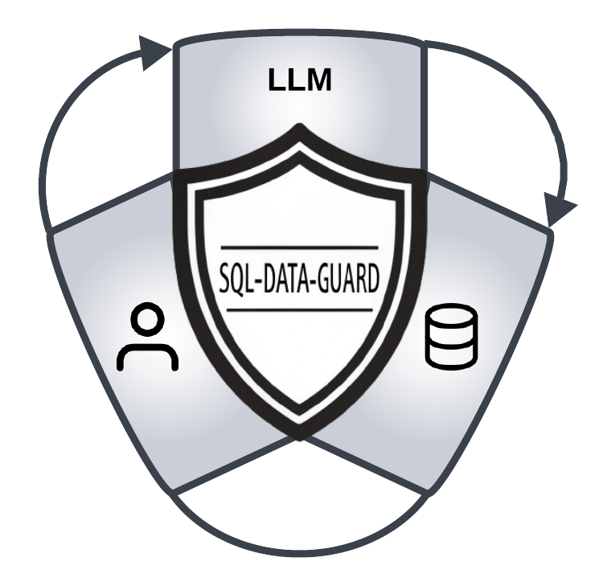

# sql-data-guard: Safety Layer for LLM Database Interactions

<div style="text-align: center;">
    
</div>

SQL is the go-to language for performing queries on databases, and for a good reason - it’s well known, easy to use and pretty simple. However, it seems that it’s as easy to use as it is to exploit, and SQL injection is still one of the most targeted vulnerabilities - especially nowadays with the proliferation of “natural language queries” harnessing Large Language Models (LLMs) power to generate and run SQL queries.


To help solve this problem, we developed sql-data-guard, an open-source project designed to verify that SQL queries access only the data they are allowed to. It takes a query and a restriction configuration, and returns whether the query is allowed to run or not. Additionally, it can modify the query to ensure it complies with the restrictions. sql-data-guard has also a built-in module for detection of malicious payloads, allowing it to report on and remove malicious expressions before query execution.


sql-data-guard is particularly useful when constructing SQL queries with LLMs, as such queries can’t run as prepared statements. Prepared statements secure a query’s structure, but LLM-generated queries are dynamic and lack this fixed form, increasing SQL injection risk. sql-data-guard mitigates this by inspecting and validating the query's content.


By verifying and modifying queries before they are executed, sql-data-guard helps prevent unauthorized data access and accidental data exposure. Adding sql-data-guard to your application can prevent or minimize data breaches and the impact of SQL injection attacks, ensuring that only permitted data is accessed. 


Connecting LLMs to SQL databases without strict controls can risk accidental data exposure, as models may generate SQL queries that access sensitive information. OWASP highlights cases of poor sandboxing leading to unauthorized disclosures, emphasizing the need for clear access controls and prompt validation. Businesses should adopt rigorous access restrictions, regular audits, and robust API security, especially to comply with privacy laws and regulations like GDPR and CCPA, which penalize unauthorized data exposure.

## Why Use sql-data-guard?

Consider using sql-guard if your application constructs SQL queries, and you need to ensure that only permitted data is accessed. This is particularly beneficial if:
- Your application generates complex SQL queries.
- Your application employs LLM (Large Language Models) to create SQL queries, making it difficult to fully control the queries.
- Different application users and roles should have different permissions, and you need to correlate an application user or role with fine-grained data access permission.
- In multi-tenant applications, you need to ensure that each tenant can access only their data, which requires row-level security and often cannot be done using the database permissions model.

sql-guard does not replace the database permissions model. Instead, it adds an extra layer of security, which is crucial when implementing fine-grained, column-level, and row-level security is challenging or impossible. 
Data restrictions are often complex and cannot be expressed by the database permissions model. For instance, you may need to restrict access to specific columns or rows based on intricate business logic, which many database implementations do not support. Instead of relying on the database to enforce these restrictions, sql-guard helps you overcome vendor-specific limitations by verifying and modifying queries before they are executed.

## How It Works

1. **Input**: sql-data-guard takes an SQL query and a restriction configuration as input.
2. **Verification**: It verifies whether the query complies with the restrictions specified in the configuration.
3. **Modification**: If the query does not comply, sql-data-guard can modify the query to ensure it meets the restrictions.
4. **Output**: It returns whether the query is allowed to run or not, and if necessary, the modified query.

sql-data-guard is designed to be easy to integrate into your application. It provides a simple API that you can call to verify and modify SQL queries before they are executed. You can integrate it using REST API or directly in your application code. 

## Example

Below you can find a Python snippet with allowed data access configuration, and usage of sql-data-guard. sql-data-guard finds a restricted column and an “always-true” possible injection and removes them both. It also adds a missing data restriction:

```python
from sql_data_guard import verify_sql

config = {
    "tables": [
        {
            "name": "orders",
            "columns": ["id", "product_name", "account_id"],
            "restrictions": [{"column": "account_id", "value": 123}]
        }
    ] 
}

query = "SELECT id, name FROM orders WHERE 1 = 1"
result = verify_sql(query, config)
print(result)
```
Output:
```json
{
    "allowed": false,
    "errors": ["Column name not allowed. Column removed from SELECT clause", 
      "Always-True expression is not allowed", "Missing restriction for table: orders column: account_id value: 123"],
    "fixed": "SELECT id, product_name, account_id FROM orders WHERE account_id = 123"
}
```
Here is a table with more examples of SQL queries and their corresponding JSON outputs:

| SQL Query                                               | JSON Output                                                                                                                                                                         |
|---------------------------------------------------------|-------------------------------------------------------------------------------------------------------------------------------------------------------------------------------------|
| SELECT id, product_name FROM orders WHERE account_id = 123 | { "allowed": true, "errors": [], "fixed": null }                                                                                                                                    |
| SELECT id FROM orders WHERE account_id = 456            | { "allowed": false, "errors": ["Missing restriction for table: orders column: account_id value: 123"], "fixed": "SELECT id FROM orders WHERE account_id = 456 AND account_id = 123" } |
| SELECT id, col FROM orders WHERE account_id = 123      | { "allowed": false, "errors": ["Column col is not allowed. Column removed from SELECT clause"], "fixed": "SELECT id FROM orders WHERE account_id = 123" } ```               |
| SELECT id FROM orders WHERE account_id = 123 OR 1 = 1 | { "allowed": false, "errors": ["Always-True expression is not allowed"], "fixed": "SELECT id FROM orders WHERE account_id = 123" }                                                  |
|SELECT * FROM orders WHERE account_id = 123| {"allowed": false, "errors": ["SELECT * is not allowed"], "fixed": "SELECT id, product_name, account_id FROM orders WHERE account_id = 123"}                                |
```


This table provides a variety of SQL queries and their corresponding JSON outputs, demonstrating how `sql-data-guard` handles different scenarios.

## Installation
To install sql-data-guard, use pip:

```bash
pip install sql-data-guard
```
### **Restriction Schema and Validation**

Restrictions are utilized to validate queries by ensuring that only supported operations are applied to the columns of tables.
The core logic for this validation is handled by the `validate_restrictions` function. The restrictions determine how values are compared against table columns in SQL queries. Below is a breakdown of how the restrictions are validated, the available operations, and the conditions under which they are applied.

#### **Supported Operations**

The following operations are supported in the restriction schema:

- **`=`**: Equal to – Checks if the column value is equal to a given value.
- **`>`**: Greater than – Checks if the column value is greater than a specified value.
- **`<`**: Less than – Checks if the column value is less than a given value.
- **`>=`**: Greater than or equal to – Checks if the column value is greater than or equal to a specified value.
- **`<=`**: Less than or equal to – Checks if the column value is less than or equal to a given value.
- **`BETWEEN`**: Between two values – Validates if the column value is within a specified range.
- **`IN`**: In a specified list of values – Validates if the column value matches any of the values in the given list.

These operations are validated by the `validate_restrictions` function to ensure that only supported operations are used and that they follow the correct format.

#### **Restriction Structure**

Each restriction in the configuration consists of the following keys:
- **`column`**: The name of the column the restriction is applied to (e.g., `"price"` or `"order_id"`).
- **`value`** or **`values`**: The value(s) to compare the column against:
  - If the operation is `BETWEEN`, the `values` field should contain a list of two numeric values, representing the lower and upper bounds of the range.
  - For operations like `IN` or comparison operations (e.g., `=`, `>`, `<=`), the `value` or `values` field will contain one or more values to compare.
- **`operation`**: The operation to apply to the column. This could be any of the supported operations, such as `BETWEEN`, `IN`, `=`, `>`, etc.

#### **Validation Rules for Specific Operations**

1. **BETWEEN**:
   - The `BETWEEN` operation requires the `values` field to contain a list of exactly two numeric values. The first value must be less than the second.
   - **Example**: 
     ```
     "operation" : "BETWEEN", 
     "values": [100, 200]
     ```
   - In this case, the `price` column must have a value between 100 and 200.

2. **IN**:
   - The `IN` operation requires the `values` field to be a list containing multiple values to match the column against. The values can be of types such as integers, floats, or strings.
   - **Example**:
     ```
     "operation": "IN", 
     "values": [100, 200, 300]
     ```
   - In this case, the `category` column will be checked to see if its value matches one of the values in the list: 100, 200, or 300.

3. **Comparison Operations (>=, <=, =, <, >)**:
   - These operations apply a comparison between the column and a single value. The value must be numeric for comparison operations like `>=`, `<`, etc.
   - **Example**: 
        ```
     "operation": ">=", 
     "value": 100
     ```
   - In this case, the `price` column must have a value greater than or equal to 100.

#### **Error Handling and Restrictions**

The validation function checks that the restrictions adhere to the following rules and raises errors if any of these conditions are violated:

1. **Unsupported Operations**:
   - If an unsupported operation is used in the configuration, an `UnsupportedRestrictionError` is raised. Only operations listed in the "Supported Operations" section are allowed.

2. **Missing Columns or Tables**:
   - If a table in the configuration is missing either the `columns` or `table_name` fields, or if no tables are provided in the configuration, a `ValueError` is raised. Every table must specify these fields.

3. **Invalid Data Types**:
   - If the `value` or `values` in the restriction do not match the expected data types (e.g., using non-numeric values for comparison operations), a `ValueError` will be raised.
 For example:
   - A `BETWEEN` operation that doesn’t provide a list of two numeric values will trigger an error:
     ```
     "operation": "BETWEEN", 
     "values": ["A", "B"]
     ```
     This would raise an error because the values are not numeric.

4. **Invalid `IN` Format**:
   - If the `IN` operation is provided with invalid data types (e.g., a list with mixed types like numbers and strings), it will also result in a validation error:
     ```
     "operation": "IN", 
     "values": [100, "Electronics"]
     ```
     This would raise an error because the values are not consistently of the same data type.

## Docker Repository

sql-data-guard is also available as a Docker image, which can be used to run the application in a containerized environment. This is particularly useful for deployment in cloud environments or for maintaining consistency across different development setups.

### Running the Docker Container

To run the sql-data-guard Docker container, use the following command:

```bash
docker run -d --name sql-data-guard -p 5000:5000 ghcr.io/thalesgroup/sql-data-guard

### Calling the Docker Container Using REST API

Once the `sql-data-guard` Docker container is running, you can interact with it using its REST API. Below is an example of how to verify an SQL query using `curl`:

```bash
curl -X POST http://localhost:5000/verify-sql \
     -H "Content-Type: application/json" \
     -d '{
           "sql": "SELECT * FROM orders WHERE account_id = 123",
           "config": {
             "tables": [
               {
                 "table_name": "orders",
                 "columns": ["id", "product_name", "account_id"],
                 "restrictions": [{"column": "account_id", "value": 123}]
               }             
            ]
           }
         }'
```

## Contributing
We welcome contributions! Please see our [CONTRIBUTING.md](CONTRIBUTING.md) for more details.

## License
This project is licensed under the MIT License. See the [LICENSE](LICENSE) file for details.
