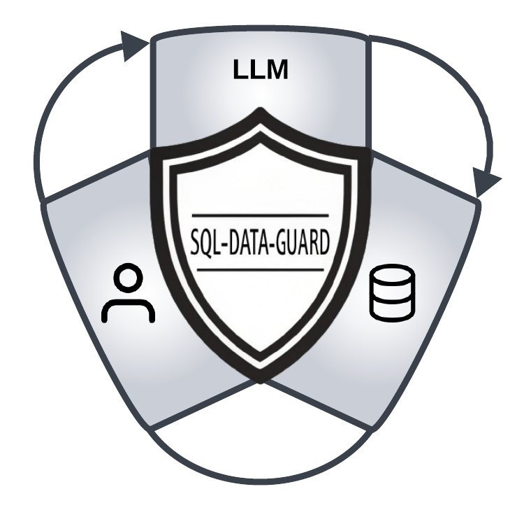

# ✨ sql-data-guard: The Ultimate Agentic Safety Shield 🛡️

<div align="center">
    
    <p><b>Secure LLM Database Interactions • Agentic Era Ready • Podman First 🚀</b></p>
</div>

---

[](https://pypi.org/project/sql-data-guard/)
[](https://opensource.org/licenses/MIT)
[](https://pypi.org/project/sql-data-guard/)

SQL is the go-to language for performing queries on databases, and for good reason — it’s well known, powerful, and expressive. However, dynamic SQL generation is highly vulnerable to exploitation, and SQL injection remains a top threat. This is especially true today with the proliferation of **natural language queries** leveraging Large Multi-Modal Models and LLMs to dynamically generate and run database operations.

To solve this, **sql-data-guard** acts as a lightweight, deterministic security and safety layer that verifies whether SQL queries access only the data they are authorized to. It inspects a query alongside a restriction configuration, validates permissions (table-level, column-level, and row-level), blocks malicious payloads, and can even automatically rewrite non-compliant queries on the fly to enforce safety boundaries.

---

## 🎨 Visual Overview & Architecture 🛡️

The following diagram illustrates how `sql-data-guard` sits as an intelligent gateway protecting your databases from dynamic or LLM-generated queries across different integration paths:

```text
               ┌───────────────────────────────┐
               │    LLM / AI Application       │
               │   (Generates Dynamic SQL)     │
               └───────────────┬───────────────┘
                               │
                               ▼
      ┌─────────────────────────────────────────────────┐
      │                SQL DATA GUARD 🛡️                │
      │  (Validates, Filters, Rewrites, Secures SQL)    │
      ├─────────────────────────────────────────────────┤
      │                                                 │
      │  [1] Python SDK     ──► verify_sql(query, conf) │
      │  [2] REST API       ──► /verify-sql (Post/JSON) │
      │  [3] MCP Wrapper    ──► JSON-RPC Proxy Container│
      │  [4] Dify Plugin    ──► Visual Workflow Node    │
      │                                                 │
      └────────────────────────┬────────────────────────┘
                               │
               ┌───────────────┴───────────────┐
               │         Is Compliant?         │
               └───────┬───────────────┬───────┘
                       │               │
                  Yes  │               │ No
                       ▼               ▼
              ┌────────────────┐┌───────────────┐
              │    Database    ││ Blocked /     │
              │ (Execute query)││ Fixed Query   │
              └────────────────┘└───────────────┘
```

---

## 🎙️ Vibe Coding & Agentic Era Ready! 🤖✨

This repository is built for the **Agentic Era**. We don't just write code; we *vibe-code* at the speed of thought. Powered by **opencode** and **OpenSpec**, development on this project is fully orchestrated by AI agents.

### 🔄 The Vibe Coding Loop

```text
 ┌────────────────────────────────────────────────────────┐
 │               🎙️  THE VIBE CODING LOOP                  │
 └───────────────────────────┬────────────────────────────┘
                             │
                  1. Intent  │ (e.g., "Make it fancy! ✨")
                             ▼
 ┌────────────────────────────────────────────────────────┐
 │           🤖  OPENCODE AGENT (with MCP Tools)          │
 ├────────────────────────────────────────────────────────┤
 │   Uses GitHub MCP Server to read issues/PRs            │
 │   Loads specialized skills (e.g., modern-python)       │
 └───────────────────────────┬────────────────────────────┘
                             │
              2. Spec Design │ (Proposals & Tasks)
                             ▼
 ┌────────────────────────────────────────────────────────┐
 │              📜  OPENSPEC ARTIFACTS                    │
 │   - proposal.md  - design.md  - tasks.md               │
 └───────────────────────────┬────────────────────────────┘
                             │
         3. Auto-Verify      │ (Unit Tests & Quality Reports)
                             ▼
 ┌────────────────────────────────────────────────────────┐
 │         🚀  PRODUCTION READY BUILD (Podman 🐳)          │
 └────────────────────────────────────────────────────────┘
```

#### 🛡️ Built-in Agentic Tooling:
- **opencode** 🧑‍💻: Our interactive AI co-pilot managing high-level feature designs.
- **OpenSpec Workflow** 📜: A specification-driven approach to development. We capture ideas in markdown proposals, designs, and tasks before touching a single line of production code.
- **GitHub MCP Server** 🐙: Out-of-the-box integration allowing AI agents to draft PR reviews, comment on commits, and triage issues directly.
- **Supercharged Skills** ⚡: Context-aware agent instructions (`modern-python`, `openspec-apply-change`) designed to keep code quality immaculate.

---

## 💡 Why Use sql-data-guard?

Dynamic queries cannot be run as traditional prepared statements. While prepared statements secure a query's static structure, LLM-generated queries are completely dynamic, increasing SQL injection risk. `sql-data-guard` mitigates this risk by inspecting the actual query content before execution. It is particularly useful if:

- 🧠 Your application employs LLMs to dynamically generate SQL queries based on natural language.
- 👥 Users or roles require fine-grained, column-level, or row-level permissions.
- 🏢 In multi-tenant applications, you must guarantee that each tenant accesses only their data (row-level security) without rewriting complex database schema permissions.
- 🛡️ You want an extra vendor-agnostic security shield to overcome vendor-specific database access model limitations.

---

## 📁 Repository Anatomy 🗺️

Here is how the magic is organized under the hood:

```text
sql-data-guard/
├── ⚙️ src/sql_data_guard/             # 🧠 Core security engine & entrypoints
│   ├── sql_data_guard.py              #   ├─ verify_sql() main logic
│   ├── restriction_verification.py    #   ├─ Policy enforcement
│   ├── restriction_validation.py      #   ├─ Schema integrity checks
│   ├── 🌐 rest/                       #   ├─ FastAPI REST microservice
│   └── 🤖 mcpwrapper/                 #   └─ JSON-RPC Model Context Protocol proxy
├── 🔌 plugins/dify/                   # 🧩 Custom Dify visual plugin
├── 💡 examples/                       # 📂 Quickstart and demo setups (SQLite/Postgres)
├── 📜 openspec/                       # 📋 Change specs, designs, and tasks
├── 📖 docs/                           # 📚 Sphinx documentation & User Manual
├── 🧪 tests/                          # 🩺 Pytest suite (Unit & LLM integration tests)
└── 🛠️ scripts/                        # 🧼 Quality, coverage & build helpers
```

---

## ⚡ Integration Channels

`sql-data-guard` provides 4 flexible ways to integrate with your tech stack:

### 🐍 [1] Python Library (SDK)

Install directly via `pip`:
```bash
pip install sql-data-guard
```

#### Code Example:
```python
from sql_data_guard import verify_sql

config = {
    "tables": [
        {
            "table_name": "orders",
            "columns": ["id", "product_name", "account_id"],
            "restrictions": [{"column": "account_id", "value": 123}]
        }
    ] 
}

query = "SELECT id, name FROM orders WHERE 1 = 1"
result = verify_sql(query, config)
print(result)
```

#### JSON Output:
```json
{
    "allowed": false,
    "errors": [
      "Column name not allowed. Column removed from SELECT clause", 
      "Always-True expression is not allowed", 
      "Missing restriction for table: orders column: account_id value: 123"
    ],
    "fixed": "SELECT id, product_name, account_id FROM orders WHERE account_id = 123"
}
```

---

### 🌐 [2] REST API (Containerized)

Deploy as a standalone Microservice using **Podman** (or Docker).

#### 🐳 Run the Container:
```bash
podman run -d --name sql-data-guard -p 5000:5000 ghcr.io/thalesgroup/sql-data-guard:latest
```

#### 📡 Call the API:
```bash
curl -X POST http://localhost:5000/verify-sql \
     -H "Content-Type: application/json" \
     -d '{
           "sql": "SELECT * FROM orders WHERE account_id = 123",
           "config": {
             "tables": [
               {
                 "table_name": "orders",
                 "columns": ["id", "product_name", "account_id"],
                 "restrictions": [{"column": "account_id", "value": 123}]
               }             
             ]
           }
         }'
```

---

### 🤖 [3] Model Context Protocol (MCP) Wrapper

Secure database streams natively. This wrapper acts as an interceptor proxy between any MCP client (such as Claude Desktop or a LangChain agent) and an inner database MCP server (like SQLite or Postgres).

#### 🐳 Run the Wrapper with Podman:
```bash
podman run -d \
  --name sql-data-guard-mcp \
  -v /var/run/docker.sock:/var/run/docker.sock:ro \
  -v ./config.json:/conf/config.json:ro \
  ghcr.io/thalesgroup/sql-data-guard-mcp:latest
```
*(See `examples/mcp-wrapper-sqlite` for config formats and complete setup guides.)*

---

### 🔌 [4] Dify Plugin

A visual workflow node for the Dify platform to secure your LLM-based agent pipelines. See the [Dify Plugin README](plugins/dify/README.md) for full setup instructions and workflow schemas.

---

## 📊 Verification Examples

Here is how `sql-data-guard` parses and secures various SQL scenarios:

| SQL Query | JSON Output | Description |
| :--- | :--- | :--- |
| `SELECT id, product_name FROM orders WHERE account_id = 123` | `{ "allowed": true, "errors": [], "fixed": null }` | Fully compliant query. |
| `SELECT id FROM orders WHERE account_id = 456` | `{ "allowed": false, "errors": ["Missing restriction..."], "fixed": "SELECT id FROM orders WHERE account_id = 456 AND account_id = 123" }` | Enforces missing restriction constraint. |
| `SELECT id, col FROM orders WHERE account_id = 123` | `{ "allowed": false, "errors": ["Column col is not allowed..."], "fixed": "SELECT id FROM orders WHERE account_id = 123" }` | Auto-removes unauthorized columns. |
| `SELECT id FROM orders WHERE account_id = 123 OR 1 = 1` | `{ "allowed": false, "errors": ["Always-True expression is not allowed"], "fixed": "SELECT id FROM orders WHERE account_id = 123" }` | Strips out SQL Injection bypass attempts. |
| `SELECT * FROM orders WHERE account_id = 123` | `{"allowed": false, "errors": ["SELECT * is not allowed"], "fixed": "SELECT id, product_name, account_id FROM orders WHERE account_id = 123"}` | Restricts open wildcards to authorized columns. |

---

## 📜 Configuration & Policies

All restriction rules are expressed via standard JSON configurations. You can configure:
- **Authorized Columns**: Only explicit columns can be queried.
- **Row-Level Constraints**: Filter operations such as `=`, `>`, `<`, `>=`, `<=`, `BETWEEN`, and `IN` on column values.

For the comprehensive specification of policy schemas and supported operators, see the [User Manual](docs/manual.md).

---

## 🧪 Development & Quality Checks

We maintain the highest standards of code quality and coverage.

To setup the development environment:
```bash
uv sync --all-groups
```

To run unit tests:
```bash
PYTHONPATH=src python -m pytest --color=yes tests/*_unit.py tests/test_verification_utils.py
```

To generate a full quality, coverage, and docstring report (which populates the beautiful `QUALITY_REPORT.md` dashboard):
```bash
python scripts/generate_quality_report.py
```

---

## 🤝 Contributing

We welcome agentic and human contributions! Please read our [CONTRIBUTING.md](CONTRIBUTING.md) for detailed guidelines.

## 📄 License

This project is licensed under the MIT License. See [LICENSE.md](LICENSE.md) for details.
